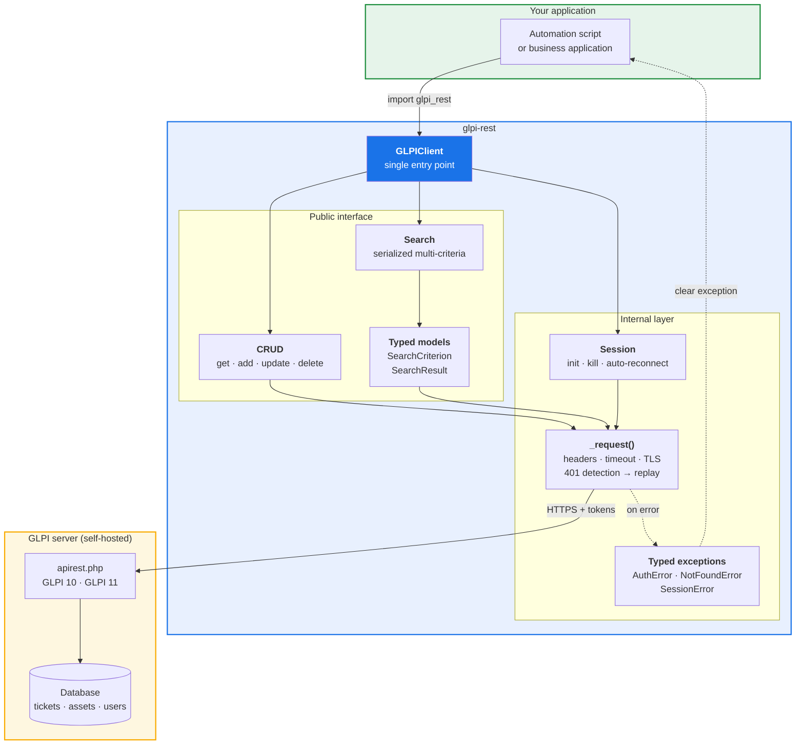
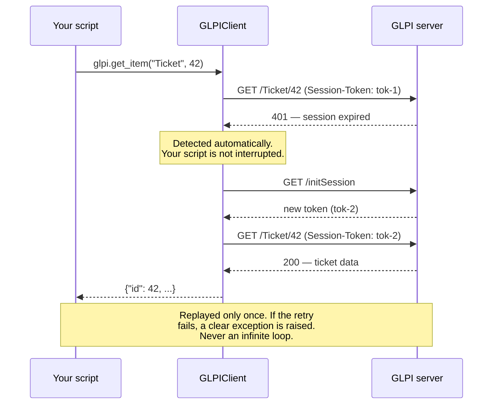

<div align="center">

# glpi-rest

**A modern, fully typed Python client for the [GLPI](https://glpi-project.org) REST API — with automatic session recovery.**

[](https://github.com/novagiosAI/glpi-rest/actions/workflows/ci.yml)
[](https://pypi.org/project/glpi-rest/)
[](https://pypi.org/project/glpi-rest/)
[](LICENSE)
[](https://peps.python.org/pep-0561/)

*Integration-tested against live GLPI 10 and GLPI 11 servers.*

</div>

---

## Why another GLPI client?

The GLPI REST API works, but using it from Python is unpleasant: search criteria must be
hand-serialized into `criteria[0][field]`-style parameters, responses are untyped
dictionaries, and **sessions silently expire** — leaving your automation to crash with a
`401` at 3 a.m.

The landscape, checked against PyPI and GitHub in September 2026:

| Package | Last release | Typed | Recovers an expired session |
|---|---|:---:|:---:|
| `glpi_py` (Grupo Parawa) | 0.4.2, Mar 2026 | partial | ❌ see note |
| `python-glpi-api` (unistra) | 0.7.0, Mar 2025 | ❌ | ❌ |
| `mcphargus/python-glpi` | 2018 | ❌ | ❌ |
| `AnatomicJC/glpi-client` | 2017 | ❌ | ❌ |
| **`glpi-rest`** | **active** | ✅ strict | ✅ |

`glpi_py` is the one worth knowing about: recent, actively maintained, and it
covers more item types than this package does — documents, SLAs, entities,
categories. If you need that breadth, use it.

It also *implements* session recovery, in a `request` decorator that catches an
`Unauthorized` exception and retries the call. That exception is documented as
*"Raised if a request produces a 401 error"* — but the code that raises it
checks for **403**:

```python
# glpi_py/connection.py, v0.4.2 — abridged
class Unauthorized(Exception):
    # docstring says: raised if a request produces a 401 error
    ...

class _Session(Session):
    def request(self, *args, **kwargs):
        response = super().request(*args, **kwargs)
        if response.status_code == 403:      # 401 never reaches the handler
            raise Unauthorized
        return response
```

GLPI answers `401 ERROR_SESSION_TOKEN_INVALID` when a session expires, so the
retry never fires for the case it was written for. Measured on v0.4.2 against a
mocked server returning 401 then 200: the caller receives the raw 401 and no
re-authentication is attempted. The identical scenario against this package
returns the ticket.

Two smaller things found while testing v0.4.2: `typing_extensions`, `arrow` and
`leopards` are imported but not declared as dependencies, so a clean install
fails on import; and item URLs are built with a double slash
(`apirest.php/Ticket//42`).

These are fixable bugs, not design flaws, and they may already be fixed by the
time you read this — verify before relying on the comparison.

## Installation

```bash
pip install glpi-rest
```

## Quickstart

```python
from glpi_rest import GLPIClient, SearchCriterion

with GLPIClient(
    "https://glpi.example.com/apirest.php",
    app_token="your-app-token",
    user_token="your-user-token",
) as glpi:
    # Fetch one item
    ticket = glpi.get_item("Ticket", 42)
    print(ticket["name"])

    # List items
    for computer in glpi.get_items("Computer", range="0-19"):
        print(computer["name"])

    # Multi-criteria search — no manual parameter juggling
    result = glpi.search(
        "Ticket",
        criteria=[
            SearchCriterion(field=12, value=1, searchtype="equals"),  # status = new
        ],
    )
    print(f"{result.total_count} matching tickets")

    # Create, update, delete
    created = glpi.add_item(
        "Ticket", {"name": "Printer offline", "content": "3rd floor"}
    )
    glpi.update_item("Ticket", created["id"], {"priority": 4})
    glpi.delete_item("Ticket", created["id"])
```

The session is opened on `with` and always closed on exit — even if your code raises.

### Authentication

Either a user token (recommended) or username/password:

```python
GLPIClient(url, app_token=..., user_token=...)  # recommended
GLPIClient(url, app_token=..., username=..., password=...)  # basic auth
```

## Features

- **Automatic session recovery.** GLPI expires idle sessions. When a call returns `401`,
  `glpi-rest` transparently re-authenticates and replays the exact same request — once.
  Your code never sees the interruption, and a bad credential can never cause a retry loop.
- **Strict typing throughout.** Ships a `py.typed` marker; your IDE autocompletes methods
  and `mypy --strict` passes. Typos are caught before runtime instead of in production.
- **Readable search.** `SearchCriterion` objects replace hand-built
  `criteria[0][searchtype]` parameter soup, and results come back as a typed
  `SearchResult` with `total_count`, `count` and `data`.
- **Typed exceptions.** `GLPIAuthError`, `GLPINotFoundError`, `GLPISessionError` — catch
  what you actually care about instead of parsing error strings.
- **Secure by default.** TLS verification on, request timeouts set, credentials sent as
  headers (never in URLs, which end up in server logs).
- **No dependencies beyond `requests`.**

## Architecture



### How automatic reconnection works



## Enabling the GLPI API

In your GLPI instance, as a super-admin:

1. **Setup → General → API** — enable *Enable Rest API*.
2. Add an API client and copy its **App token**.
3. For a user token: **Administration → Users → \<your user\> → Settings**, then
   *Regenerate* under **API token**.

Use a dedicated GLPI account with only the rights your automation needs — not a
super-admin account.

## Security

`glpi-rest` talks only to the GLPI server you point it at. It collects no telemetry, contacts
no third party, and stores nothing on disk. Everything it does is auditable in this
repository.

Defaults are set for production use: TLS certificate verification is **on**, every request
carries a timeout, tokens travel in headers rather than URLs, and sessions are closed
deterministically.

Never commit tokens to source control — pass them via environment variables.

To report a vulnerability, please see [SECURITY.md](SECURITY.md).

## Compatibility

| | Supported | Verified by |
|---|---|---|
| GLPI 11.x | ✅ | full integration suite against live 11.0.2 and 11.0.8 |
| GLPI 10.x | ✅ | full integration suite against a live 10.0.26 |
| Python 3.10 – 3.13 | ✅ | unit suite on every version |
| Linux · macOS · Windows | ✅ | pure-Python, `requests` only |

### Running the integration tests

The unit suite needs no server. To exercise the client against a real GLPI:

```bash
docker compose -f docker-compose.test.yml up -d
./scripts/enable-api.sh glpi11 db11 8011     # prints the env to export
pytest tests/test_integration.py -v
```

The stack brings up GLPI 10 and GLPI 11 side by side on ports 8010 and 8011,
each with its own throwaway database.

## Contributing

Contributions are welcome — see [CONTRIBUTING.md](CONTRIBUTING.md).

```bash
git clone https://github.com/novagiosAI/glpi-rest.git
cd glpi-rest
python -m venv .venv && source .venv/bin/activate   # Windows: .venv\Scripts\activate
pip install -e ".[dev]"
pytest
```

Tests run against a mocked GLPI API, so no server is required.

## License

[Apache License 2.0](LICENSE) — free for commercial use.

---

<div align="center">

Built and maintained by **[Novagios](https://www.novagios.com)** — IT services, AI and ITSM.

</div>
